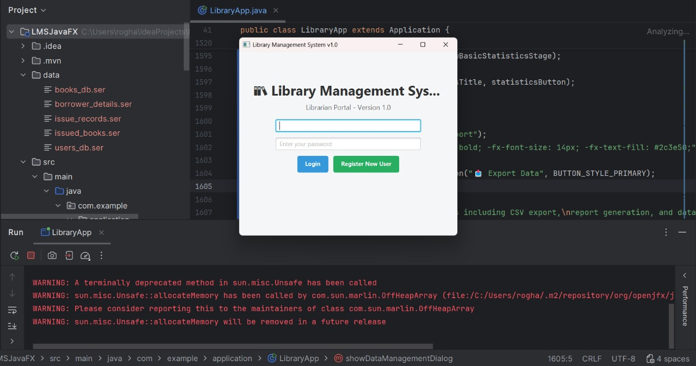
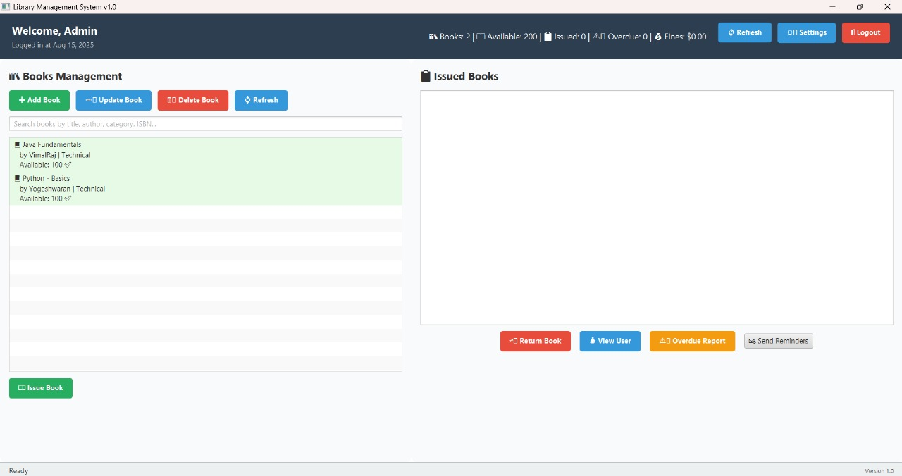

# LMSJavaFX

Welcome to **LMSJavaFX** — a Library Management System built with JavaFX. This project demonstrates best practices in Java development, featuring a clean codebase, modular design, and a user-friendly GUI for library management.

## 📦 Repository Overview

- **Language:** Java (100%)
- **Owner:** [Yoge-2004](https://github.com/Yoge-2004)
- **Purpose:** A JavaFX-based Library Management System for managing books, users, and transactions efficiently.

## 🚀 Features

- Modern JavaFX-based GUI
- Manage books, members, and library staff
- Book issue and return management
- Search and filter books and users
- User authentication and role-based access
- Comprehensive documentation and code comments

## 🖼️ Project Screenshots

<!-- Add images relevant to your project below. Replace image1.png with your actual image filename or URL. -->


<!-- Add more images as needed -->

## 📂 Directory Structure

```
LMSJavaFX/
├── src/
│   ├── main/
│   │   ├── java/
│   │   └── resources/
│   └── test/
├── assets/
│   └── screenshots/
├── README.md
├── .gitignore
└── [other files...]
```

## 🛠️ Getting Started

To run or edit the code locally:

1. **Clone the repository**
   ```bash
   git clone https://github.com/Yoge-2004/LMSJavaFX.git
   cd LMSJavaFX
   ```

2. **Open in your favorite IDE**  
   Recommended: IntelliJ IDEA, Eclipse, or VSCode with Java and JavaFX extensions.

3. **Build and run**
   - Using Maven:  
     ```bash
     mvn clean install
     mvn javafx:run
     ```
   - Or open and run directly in your IDE.

## 📖 Documentation

Each module and class is documented with Javadoc comments. Refer to the inline documentation and the `/docs` folder for detailed usage.

## 🤝 Contributing

Contributions are welcome! Please open a pull request or issue for suggestions or bug reports.

## 📄 License

This project is licensed under the MIT License. See [LICENSE](LICENSE) for more information.

## 🙋‍♂️ Author

- **Yoge-2004** — [GitHub Profile](https://github.com/Yoge-2004)

---